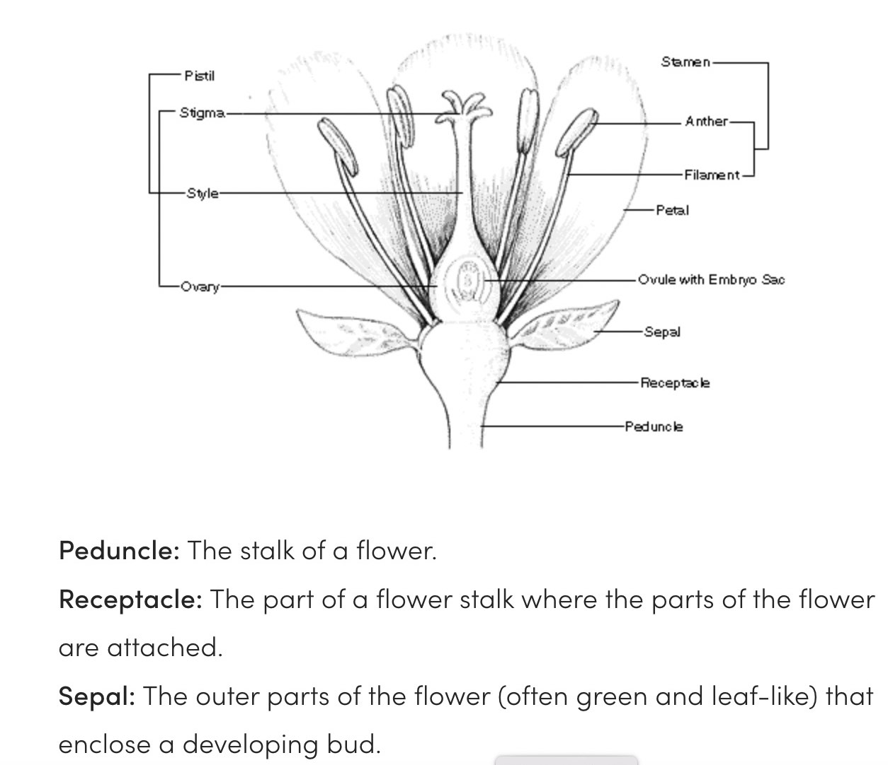

# Interactive computing for data science with R and Jupyter

This is a very brief discussion of "computing" for data science.

Computing is a broad topic.  We'll think of it in two ways

- We interact with a web browser
- We use a language, "R", to instruct the computer

This is done using a "notebook" model, where all the steps taken are recorded using the browser.

<!--
**Table of contents**

* [Controlling the notebook app](#control)
* [Defining computations with R](#first-bullet)
    - [Colon notation for sequences](#first-sub-bullet)
    - [Bracket notations](#bracket)
    - [Plotting](#plotting)
-->

## Controlling the notebook app <a class="anchor" id="control"></a>

- The "File", "Edit", "View" controls should be familiar -- they work as they do for google docs or microsoft word

- The most important buttons in the second row of controls are the "+" and "> Run" buttons.

- The notebook is made of sections called "cells".  "+" adds a cell, where you can SPECIFY a computation.

- "> Run" tells the computer to run the active cell.

## Defining computations with R <a class="anchor" id="first-bullet"></a>

- The most important computations we'll do concern tables.  Here's an example:


```R
head(iris)  # head() takes just a few rows of a potentially large table
```


```R
tail(iris)
```

The rows of the table are measurements on flowers, and a label of the flower species being measured.

The origins of the data are described [in wikipedia](https://en.wikipedia.org/wiki/Iris_flower_data_set).

Definitions of the terms Sepal and Petal come from the museum of natural history:



The numbers of rows and columns of a table are called *dimensions*.  We can find the dimensions of
the table of iris measurements:


```R
dim(iris)
```

## Colon notation for sequences <a class="anchor" id="first-sub-bullet"></a>

The notation `1:5` produces the sequence of numbers from 1 to 5 inclusive.


```R
1:5
```

## Bracket notation for tables <a class="anchor" id="bracket"></a>

We use square brackets to produce subtables.  `iris[ r, c ]` denotes a selection of
rows `r` and columns `c` from `iris`.


```R
iris[1:2, 1:3]  # first two rows, first three columns
```

We can use negative numbers in brackets to exclude rows or columns.


```R
iris[1:2, -5]
```

An important variation on bracket notation is the omission of an entry.

`iris[, c]` selects all rows but only the columns `c` from `iris`.

We can compose operations.


```R
head( iris[, 2:3])
```

## Plotting data <a class="anchor" id="plotting"></a>

The syntax `plot(x, y)` can be used to produce a scatterplot.


```R
plot(iris[,1], iris[,2])
```

A more attractive plot can be made with some more programming.


```R
library(ggplot2)
ggplot(iris, aes(x=Sepal.Length, y=Sepal.Width, colour=Species)) + geom_point(size=2)
```

This display tells how to interpret the axes, and uses color to distinguish the different species.
