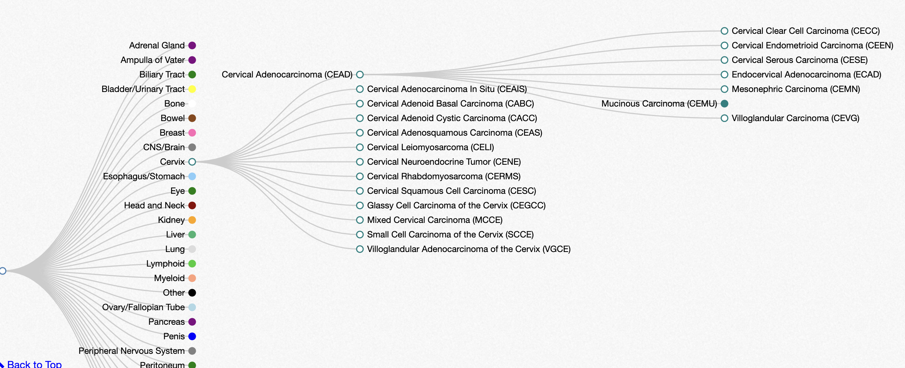

```{r setup, results="hide", echo=FALSE}
suppressPackageStartupMessages({
library(BiocYES)
library(sf)
library(tibble)
library(DT)
library(dplyr)
library(curatedTCGAData)
library(TCGAutils)
library(ontoProc)
})
```

# Overview

The BiocYES package collects software and documentation for an introduction
to data science in the domain of cancer biology, epidemiology, and treatment.
In 2022 there are five main modules covered:

- Cancer maps
- Cancer anatomy
- Cancer clinical trials
- Molecular biology of cancer: data science considerations
- Patient-initiated research

# Cancer map concepts

## Drawing maps with R

```{r lkd1}
library(BiocYES)
mass_map()
```

Exercise:  Look at the code for `mass_map` and change it to 
produce a map of Rhode Island.

## Tabulating cancer statistics with geographic metadata

### Some basic statistics by "metropolitan statistical area"

```{r lkd2}
library(tibble)
library(dplyr)
data(woncan_meta)
cat(woncan_meta, sep="\n")
data(woncan)
littab = woncan |> select(MSA, `Cancer Sites`, Age.Adjusted.Rate) |> as.data.frame()
datatable(littab, options=list(lengthMenu=c(5,10,15,20)))
```

### Representing locations

```{r lkd3}
library(sf)
data(us_county_geo)
us_county_geo[1,] |> select(state, county, geometry)
```

### Exercise

Join the location data to the `woncan` statistics.  Plot the
rates for prostate cancer at the geographic locations where
they were recorded.


# Cancer anatomy 

## TCGA sites

The Cancer Genome Atlas (TCGA) collects data on a number
of cancers defined by anatomic site.  The 37 sites available are:

```{r lktcga}
library(TCGAutils)
data(diseaseCodes)
datatable(diseaseCodes, options=list(lengthMenu=c(5,10,15,20)))
```

## Oncotree hierarchy

The Memorial Sloan-Kettering Cancer Center manages an
interactive tumor-type navigation system called oncotree.

A snapshot is:



Exercise: Use the oncotree API and operations on the JSON returned
from `http://oncotree.mskcc.org/api/tumorTypes/tree` to produce
a searchable table with columns indicating tissue, parent, UMLS tag,
and NCI code for all tumor types.

# Cancer clinical trials

## Concepts of equipoise, randomization, and simulation

## Finding clinical trials: clinicaltrials.gov


